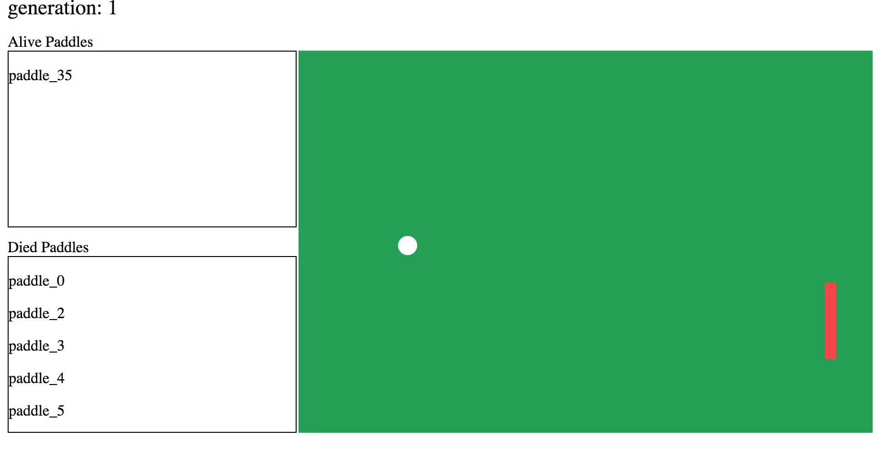

# AI Ping Pong Game
It use Genetic algorithm and Neural Network to build Ping Pong game

## Live Demo
you can see the live demo [here](https://micleming.github.io/AI-pingpong/docs/)

## Description
It will generate 20 generation paddles and each generation will use 40 amounts paddles to train neural network.



## Development
```shell
yarn start
```
Then open `http://localhost:9000/`

## Build
```shell
yarn install
yarn build
```
